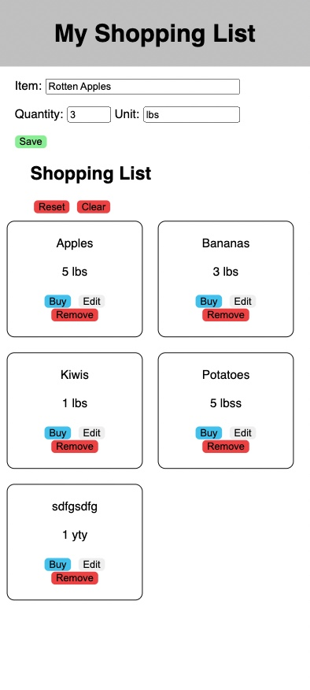

# Shopping List App

## Description

_Duration: 2 Day Sprint_

The Shopping List app helps anyone stay on top of their grocery shopping. Simply add grocery item buy filling in Item, select how many you need and what unit you need. Click the save button to add that grocery item to your shopping list. Item: and Unit: is required, user will not be able to save grocery item with those two missing inputs. Grocery items can be removed from the shopping list by simply clicking the Remove button. User can also mark an item as purchased while shopping. The item will then be marked as purchased and the Buy and Remove buttons will disappear from view. Purchased items will be sorted to the "bottom" of the shopping list. Should the user choose to start over with the current shopping spree, and buy all the same items again, click the Reset button. This will reset all Purchased items and user can buy them again. Should a case of anti establishment/ anti commercialism have a sudden onset, user can simply click the Clear button. No more items to buy. A recent feature allows the user to Edit any grocery items. Simply click the items Edit button, the item will enter an edit mode, make the necessary changes. Simply click Submit or Cancel to complete the edit.
 

## Screen Shot

### Prerequisites

Link to software that is required to develop this website.

- [javascript](https://www.javascript.com/)
- [css]
- [html]
- [git](https://git-scm.com/)
- [github](https://github.com/)
- [node](https://nodejs.org/en/)
- [body-parser](https://www.npmjs.com/package/body-parser)
- [pg](https://node-postgres.com/)
- [react](https://reactjs.org/)
- [axios](https://axios-http.com/)
- [express](https://expressjs.com/)
- [sql](https://www.mysql.com/)
- [sweetalerts2](https://sweetalert2.github.io/)

## Installation

1. Go to https://github.com/adamantdude/group-fs-react-shoppinglist/pull/8
2. Fork that repo into your own github account.
3. Copy the ssh address
4. In your terminal navigate to a folder you want to clone into.
5. Run `git clone [ssh address]` in your terminal
6. cd into the cloned folder and run `code .` in your terminal to open the project in vscode.
7. Run 'npm install'. Npm will look at your dependecies and install needed libraries.
8. Install postgress database using include database.sql file
    -  in termial execute  'createdb fs-react-shopping' and 
    -  'psql -d fs-react-shopping -f database.sql'
9. To start server run 'npm run server' and 'npm run client'.
10. If it started, terminal will display 'server is up on port 5000', and a website on localhost 3000 will open.
11. You can now enjoy this shopping app.

## Usage

1. Fill out Item with a short name. Can at most be 80 characters.
2. Fill out Quantity and chose a unit.
3. Click Save.
4. The item will be added to the Shopping List.
    - Each Item can be marked as purchased by clicking the Buy button.
    - Each Item can be removed by clicking the Remove button.
5. All items marked as Purchased can be reset to its initial state, buy clicking the Reset button.
    - The item will get Buy, Remove and Edit buttons back.
6. To remove a all items simply click Clear button. An are you sure box will open. Click anywhere to cancel or OK to clear/remove all items from shopping list.

## Built With

javascript, css, html, git and github.com, node, body-parser, pg, sql, react, sweetalerts2, express, axios

## Acknowledgement
Thanks to [Prime Digital Academy](www.primeacademy.io) who equipped and helped us to make this application a reality. (Edan Schwartz, Liz Kerber, Kris Szafranski, And Tormod Sletteboe and Adam Lee the dev team )

## Support
If you have suggestions or issues, please email me at [tormod.slettebo@gmail.com] [adam.plee23@gmail.com]

